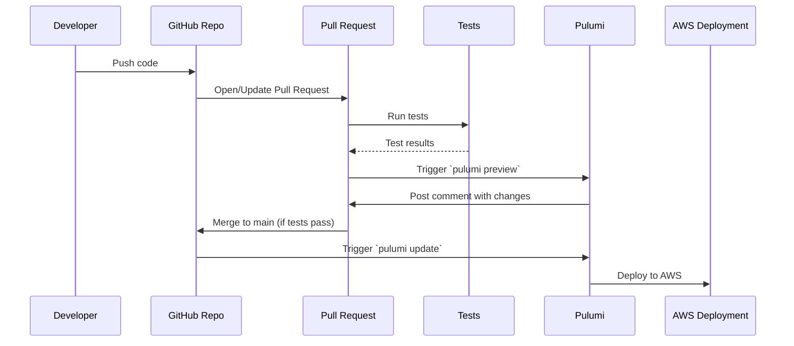
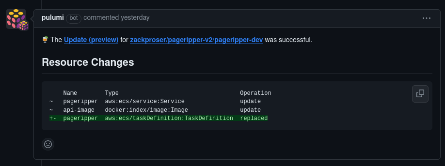
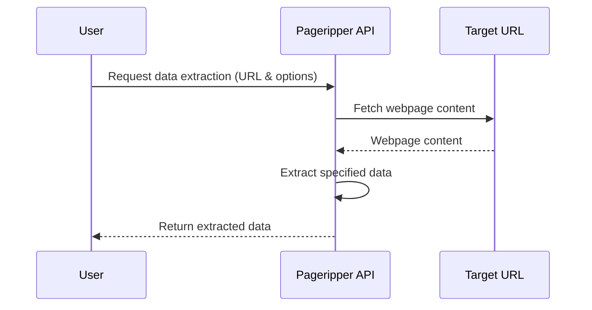

# Pageripper v2 

[](https://github.com/zackproser/pageripper-v2/actions/workflows/build-and-test.yml)
[](https://github.com/zackproser/pageripper-v2/actions/workflows/openapi.yml)
[](https://github.com/zackproser/pageripper-v2/actions/workflows/validate-openapi.yml)
[](https://github.com/zackproser/pageripper-v2/actions/workflows/pulumi-deploy.yml)


The Pageripper API extracts data from webpages; even if they are single page applications (SPAs) that are rendered via Javascript.

Pageripper allows you to customize the behavior of its headless browser on a per-request basis. Pageripper uses [Puppeteer](https://github.com/puppeteer/puppeteer).

## Example

For example, making a request to Pageripper to extract data from my portfolio site, which is a Next.js Single Page Application deployed to Vercel: 

```bash
curl -sX POST \
    -H 'Content-type: application/json' \
    -d '{"url": "https://zackproser.com", "options": {"waitUntilEvent":"networkidle2"}}' \
    https://api.pageripper.com/extracts

```

Results in: 

```javascript
{
  "emails": [],
  "twitterHandles": [],
  "socialMediaLinks": [
    "https://twitter.com/zackproser",
    "https://instagram.com/zackproser",
    "https://linkedin.com/in/zackproser"
  ],
  "mediaContentLinks": [],
  "downloadLinks": [],
  "ecommerceLinks": [],
  "urls": {
    "internal": [
      "https://zackproser.com/",
      "https://zackproser.com/about",
      "https://zackproser.com/blog",
      "https://zackproser.com/videos",
      "https://zackproser.com/projects",
      "https://zackproser.com/testimonials",
      "https://zackproser.com/contact",
      "https://zackproser.com/learn",
      "https://zackproser.com/blog/comic-strip-long-day",
      "https://zackproser.com/blog/pinecone-reference-architecture-launch",
      "https://zackproser.com/blog/run-your-own-tech-blog",
      "https://zackproser.com/blog/how-to-generate-images-with-ai"
    ],
    "external": [
      "https://github.com/zackproser",
      "https://twitter.com/zackproser",
      "https://instagram.com/zackproser",
      "https://linkedin.com/in/zackproser"
    ]
  }
}

```

Links found are categorized into internal, external, and other useful groups such as download and ecommerce links.

Additional parsing and extraction capabilities will be added to Pageripper over time.

## Features and Capabilities

* Extracts various data types: emails, URLs, social media, and media links.
* Supports SPA and JavaScript-heavy websites.
* Customizable extraction options.

## API Documentation 

[Read the Docs](https://zackproser.github.io/pageripper-v2/)

## OpenAPI Spec integration & GitHub Pages

Pageripper publishes an OpenAPI spec in this repository at `spec/openapi.yml`. 

This spec is programmatically validated, updated and published at [https://zackproser.github.io/pageripper-v2/](https://zackproser.github.io/pageripper-v2/)
every time it is modified via a pull request.

This ensures that API consumers have the latest information and that we're aware of any breaking changes early in the software development lifecycle.

## Infrastructure as Code (IaC) with Pulumi 

Pageripper is deployed on AWS and defined in Pulumi TypeScript, meaning that the entire architecture of the API, from its Docker container to its log groups, 
load balancer and security groups are defined as code. 

This means that this repository contains both the application code (Node.js, TypeScript, Dockerfile, etc) and the infrastructure code for the production API. 

Defining the cloud infrastructure as code enables tighter iterative loops between developing new features, 

## Continuous Integration and Delivery (CI/CD)

This repository is configured with GitHub Actions that run in response to lifecycle events: 



Philosophically, this setup emerges from DevOps principles (as found in The Phoenix Project and elsewhere) about reducing the friction required to 
maintain this code. 

When developers make changes and open a pull request, they get immediate feedback (that takes less than 5 minutes to complete) via unit tests, test builds for the app and Docker, etc.

When developers merge code that has passed all tests, it is automatically deployed to production, so that the `HEAD` of the `main` branch always represents what is deployed to production.

### Automated testing 

Every time a pull request is opened against this repository, the following tests are run automatically: 

* Pageripper unit tests with Jest 
* An `npm build` that compiles the application
* A Docker build that bundles Puppeteer and the application code 
* An OpenAPI spec validation

### Preview deployments on pull requests

When a pull request is issued to this repository, a `pulumi preview` is run via CI/CD against the AWS account where Pageripper is deployed: 



## How it works 

Pageripper fetches data from URLs you indicate. On a per-request level, you can configure Pageripper's behavior. 




## Usage and Examples

To use Pageripper,  send a POST request to /extracts with the target URL and options. Example:

```javascript

// Example request using Node.js
const response = await fetch('http://api.pageripper.com/extracts', {
  method: 'POST',
  body: JSON.stringify({ url: 'https://example.com', options: {...} })
});
```

The production instance of the Pageripper API is [up and available on RapidAPI](https://rapidapi.com/zackproser/api/pageripper)

## License

Pageripper V2 is released under the MIT License. See the LICENSE file for more details.
