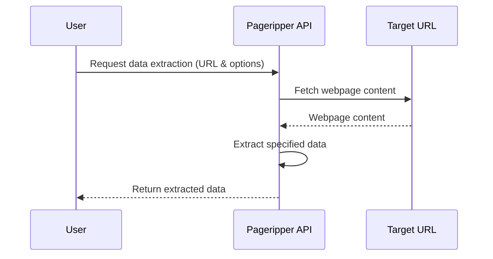

# Pageripper v2 

A data-extracting API that can handle any type of website, including single page applications rendered via Javascript.

## API Documentation 

[Read the Docs](https://zackproser.github.io/pageripper-v2/)

## How it works 

Pageripper fetches data from URLs you indicate. On a per-request level, you can configure Pageripper's behavior. 

