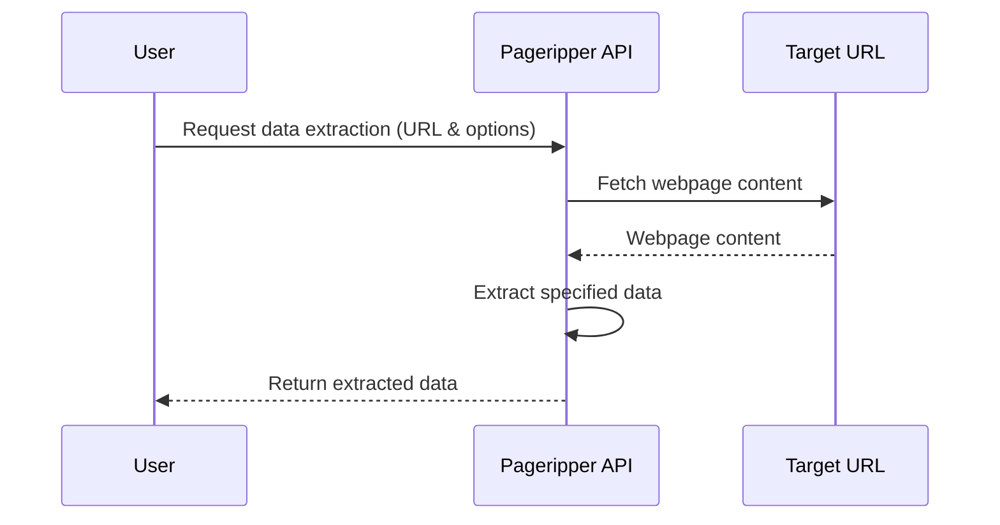

# Pageripper v2 

[](https://github.com/zackproser/pageripper-v2/actions/workflows/build-and-test.yml)
[](https://github.com/zackproser/pageripper-v2/actions/workflows/openapi.yml)
[](https://github.com/zackproser/pageripper-v2/actions/workflows/pulumi-deploy.yml)


Pageripper: An advanced web data extraction API that seamlessly fetches and analyzes content from web pages. It efficiently extracts emails, social media links, media content, and more, offering a versatile solution for web scraping and data analysis tasks.

## Features and Capabilities

* Extracts various data types: emails, URLs, social media, and media links.
* Supports SPA and JavaScript-heavy websites.
* Customizable extraction options.
* Efficient handling with Puppeteer and Cheerio.

## API Documentation 

[Read the Docs](https://zackproser.github.io/pageripper-v2/)

## How it works 

Pageripper fetches data from URLs you indicate. On a per-request level, you can configure Pageripper's behavior. 



## Usage and Examples

To use Pageripper,  send a POST request to /extracts with the target URL and options. Example:

```javascript

// Example request using Node.js
const response = await fetch('http://api.pageripper.com/extracts', {
  method: 'POST',
  body: JSON.stringify({ url: 'https://example.com', options: {...} })
});
```

The production instance of the Pageripper API is [up and available on RapidAPI](https://rapidapi.com/zackproser/api/pageripper)

## License

Pageripper V2 is released under the MIT License. See the LICENSE file for more details.
